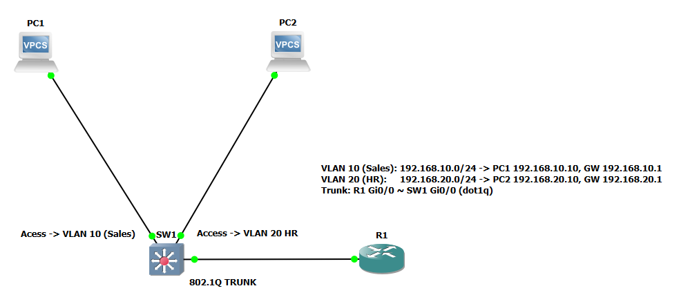
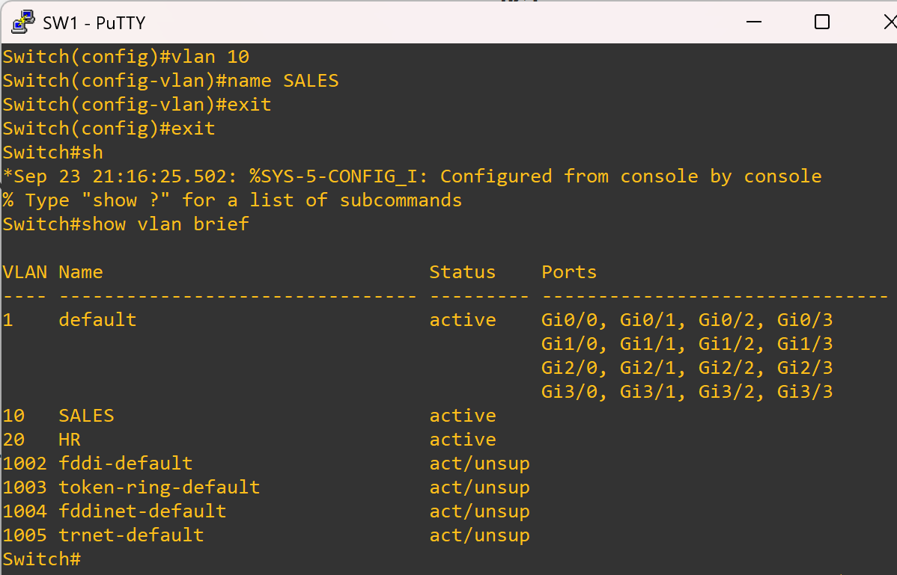
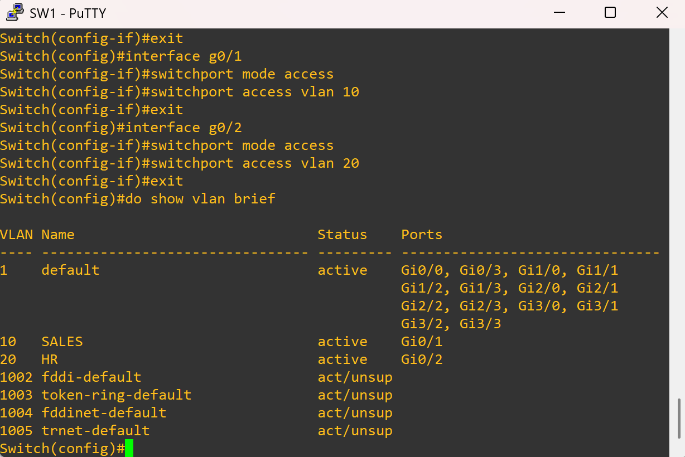
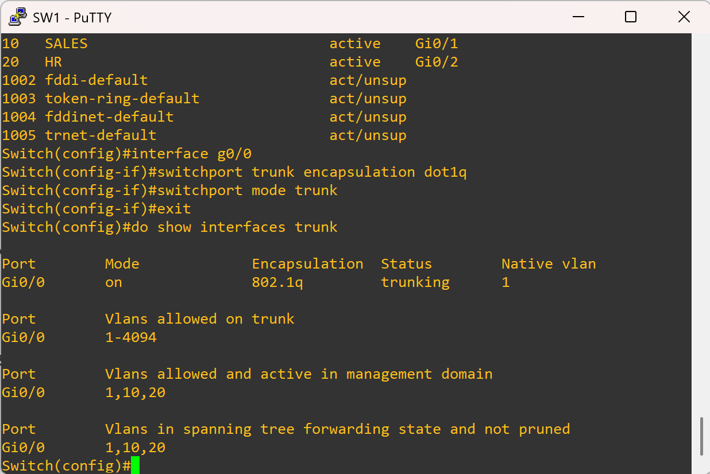
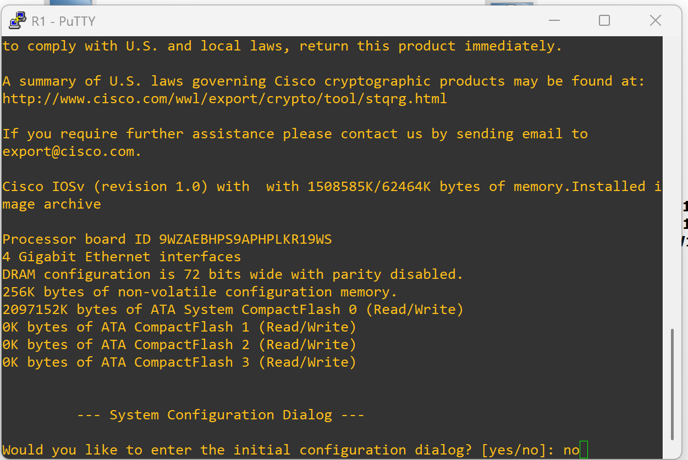
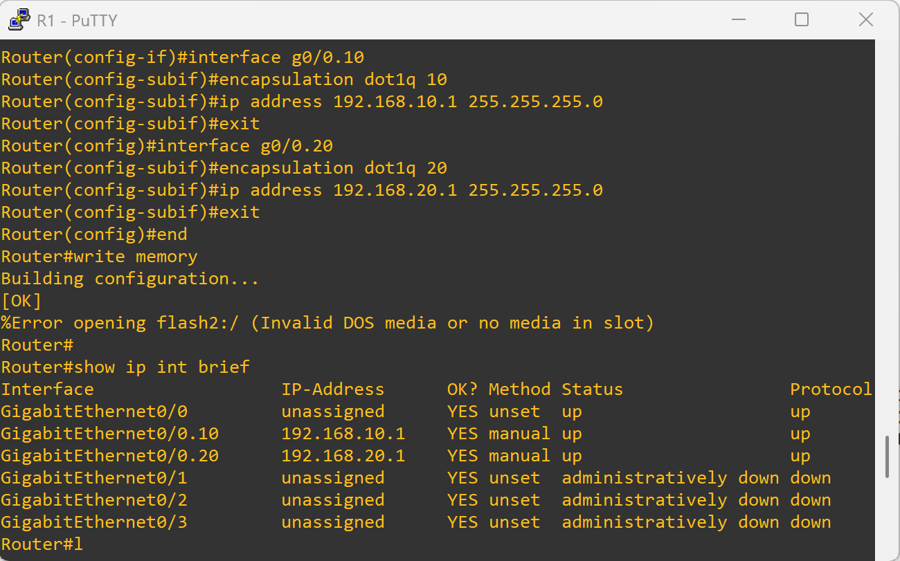
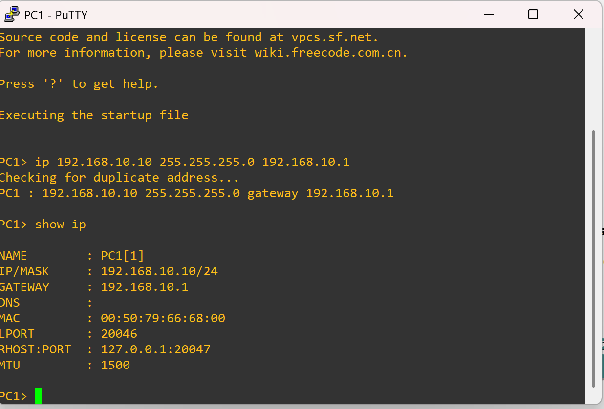
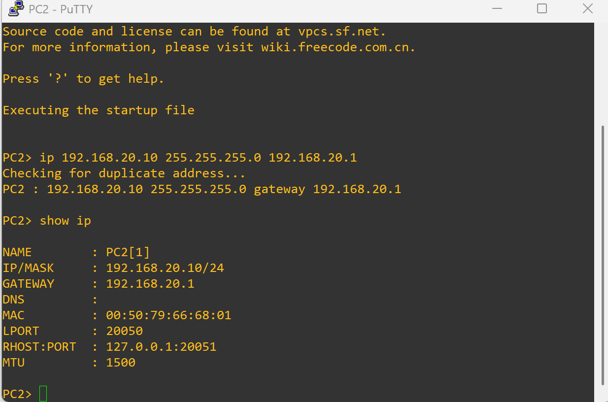
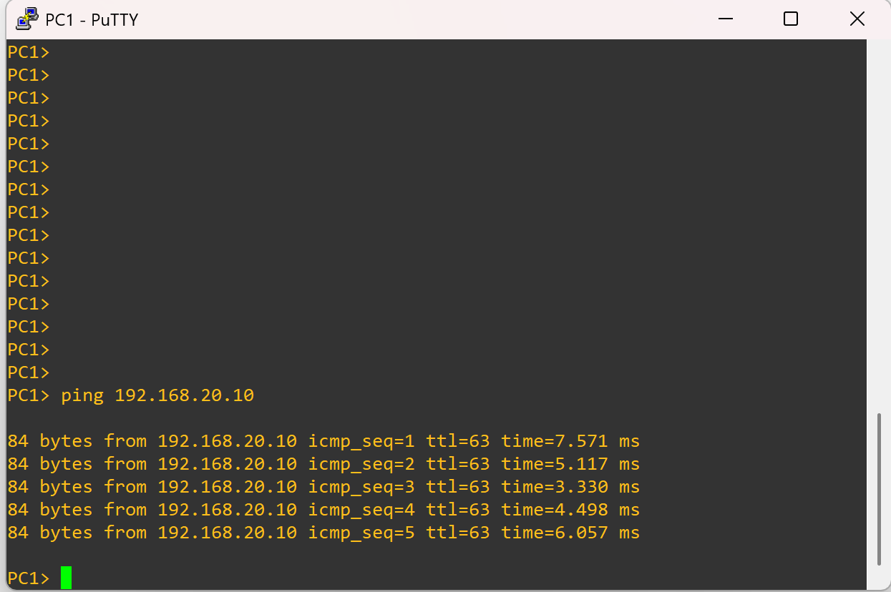
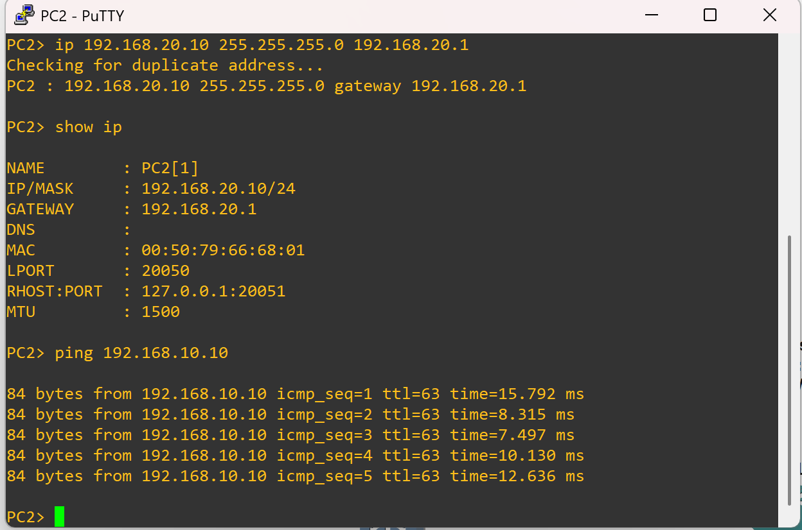

# VLAN & Inter-VLAN Routing Lab

This lab demonstrates how to configure **VLANs**, assign access ports, set up a **router-on-a-stick**, and verify inter-VLAN communication using VPCS hosts.  

It also links to **troubleshooting variants** where small misconfigurations (wrong VLAN, missing trunk, wrong default gateway) are introduced intentionally. These showcase both **diagnostic process** and **fixes**, simulating real-world troubleshooting.

## 🎯 Goal

* Create VLANs and assign ports on the switch.
* Configure a trunk toward the router.
* Build router subinterfaces for Inter-VLAN routing.
* Assign IPs to VPCS hosts and verify connectivity.

---

## 🖥️ Topology Snapshot

*(screenshot this from GNS3 canvas, before configs – Step 1)*


---

## 🔧 Switch Configuration (SW1)

### 1. Create VLANs

```cisco
vlan 10
 name SALES
vlan 20
 name HR
```



---

### 2. Assign Access Ports

```cisco
interface g0/1
 switchport mode access
 switchport access vlan 10

interface g0/2
 switchport mode access
 switchport access vlan 20
```



---

### 3. Configure Trunk Port (to R1)

```cisco
interface g0/0
 switchport trunk encapsulation dot1q
 switchport mode trunk
```



---

### 4. Save Config

```cisco
end
write memory
```

---

## 🚫 Skipping the Initial Configuration Dialog

When the switch or router boots:

```
Would you like to enter the initial configuration dialog? [yes/no]:
```

👉 Type `no`. This avoids auto-generated configs and enforces manual, professional setup.



---

## 🖧 Router Configuration (R1 – Router-on-a-Stick)

```cisco
hostname R1

interface g0/0
 no shutdown

interface g0/0.10
 encapsulation dot1Q 10
 ip address 192.168.10.1 255.255.255.0
 no shutdown

interface g0/0.20
 encapsulation dot1Q 20
 ip address 192.168.20.1 255.255.255.0
 no shutdown

end
write memory
```



---

## 🖥️ End Device Configuration

### PC1 (VPCS – VLAN 10)

```vpcs
ip 192.168.10.10 255.255.255.0 192.168.10.1
show ip
```



---

### PC2 (VPCS – VLAN 20)

```vpcs
ip 192.168.20.10 255.255.255.0 192.168.20.1
show ip
```



---

## 🌐 Connectivity Tests

### From PC1 → PC2

```vpcs
ping 192.168.20.10
```



---

### From PC2 → PC1

```vpcs
ping 192.168.10.10
```



---

## ✅ Reflection

* VLANs successfully segmented traffic at Layer 2.
* Router-on-a-stick allowed routing between VLAN 10 and VLAN 20.
* End devices could ping across VLANs once correct gateways were configured.
* This validates: VLAN creation, port assignment, trunking, router subinterfaces, and host configs.

---

## 🔀 Troubleshooting Variants

This lab also includes **intentionally broken scenarios** to showcase troubleshooting and repair skills.  

### Variant 1 – Wrong VLAN Assignment
- [Broken Config](./variant1-broken/README.md)  
- [Fixed Config](./variant1-fixed/README.md)  

### Variant 2 – Missing Trunk
- [Broken Config](./variant2-broken/README.md)  
- [Fixed Config](./variant2-fixed/README.md)  

### Variant 3 – Wrong Default Gateway
- [Broken Config](./variant3-broken/README.md)  
- [Fixed Config](./variant3-fixed/README.md)  

---

✅ These demonstrate how small misconfigurations can **break connectivity** — and how to systematically troubleshoot using `show`, `ping`, and config verification.
