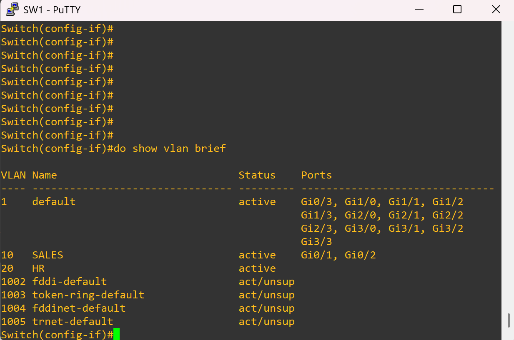
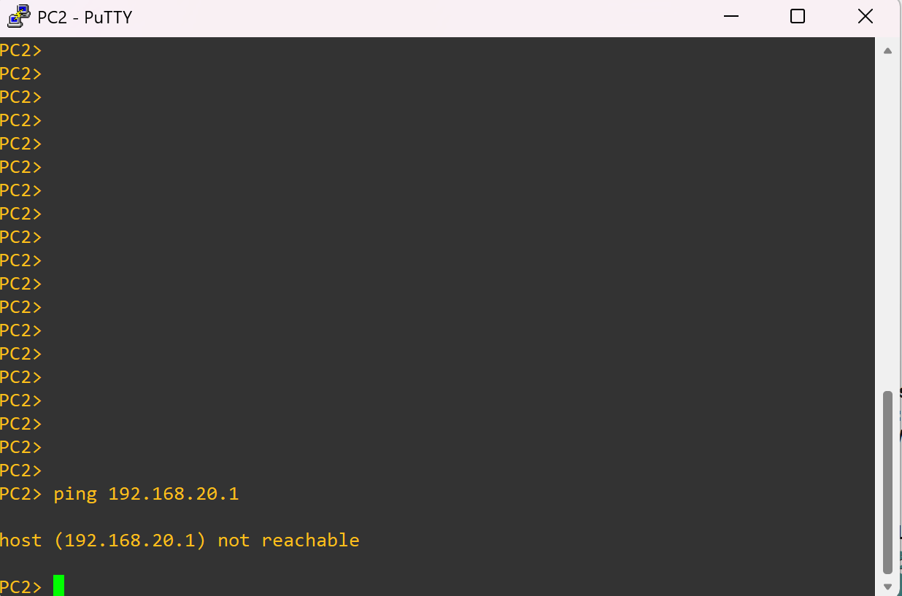

# ❌ Variant 1 – Wrong VLAN Assignment (Broken)

## 🔎 Problem
PC2 is physically connected to **Gi0/2**, but that port was mistakenly assigned to the wrong VLAN.  
Because of this mismatch, PC2 cannot reach its default gateway (`192.168.20.1`).

---

## 🖥️ Topology Snapshot
*(PC2 connected to the wrong VLAN port)*  


---

## 🖥️ Verification

### PC2 → Gateway Ping
```vpcs
ping 192.168.20.1
````

📸 

Result: Ping fails because PC2 is placed in the wrong VLAN and cannot communicate with its gateway.

---

## ✅ Reflection

* VLANs are **Layer 2 boundaries** — hosts in the wrong VLAN will never see the correct gateway.
* A simple port misassignment can break connectivity for an entire subnet.
* Always verify VLAN-to-port mapping with `show vlan brief` on the switch to confirm assignments.

```
