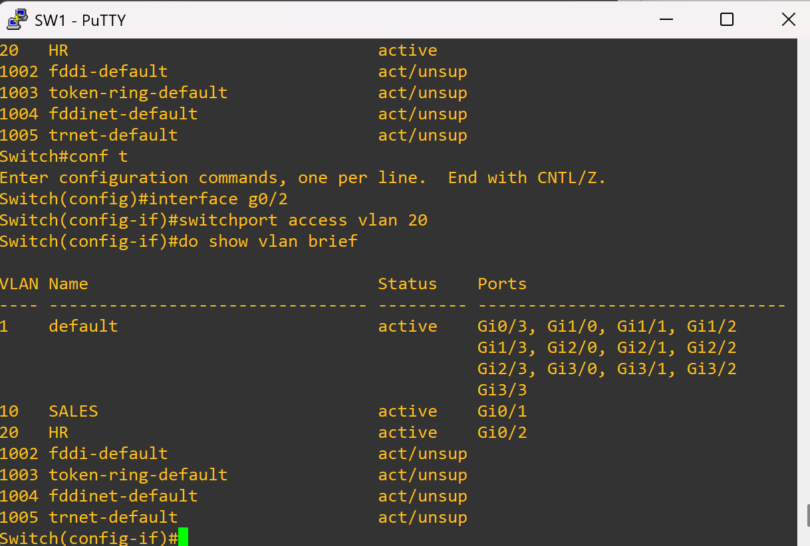
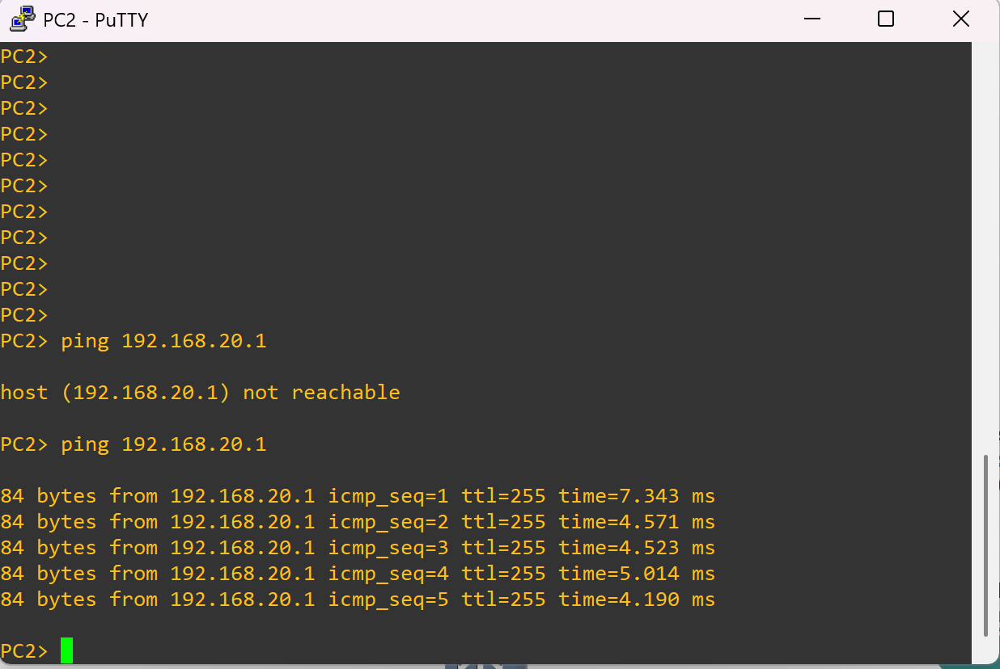

# ✅ Variant 1 – Wrong VLAN Assignment (Fixed)

## 🔧 Solution
Port **Gi0/2** was corrected to belong to **VLAN 20 (HR)**.  

```cisco
interface g0/2
 switchport mode access
 switchport access vlan 20
````

---

## 🖥️ Verification

### PC2 → Gateway Ping

```vpcs
ping 192.168.20.1
```

📸 

Result: PC2 now successfully reaches its gateway.

---

### PC2 → PC1 Ping

```vpcs
ping 192.168.10.10
```

📸 

Result: PC2 and PC1 can communicate across VLANs via R1.

---

## ✅ Reflection

* Ensuring the correct VLAN assignment for switchports is **critical for connectivity**.
* After reassigning Gi0/2 to VLAN 20, both the gateway ping and inter-VLAN routing worked as expected.
* This shows why verifying configs with `show vlan brief` should always be part of troubleshooting.
