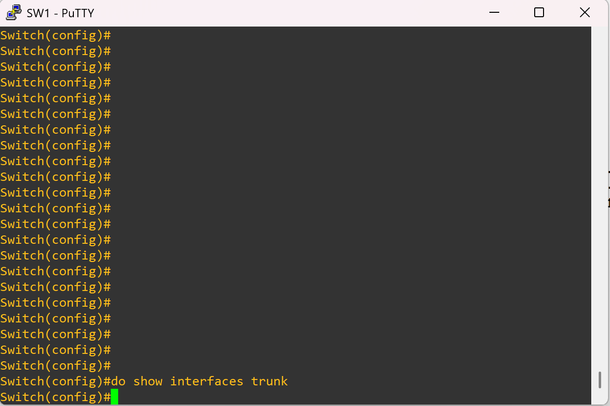
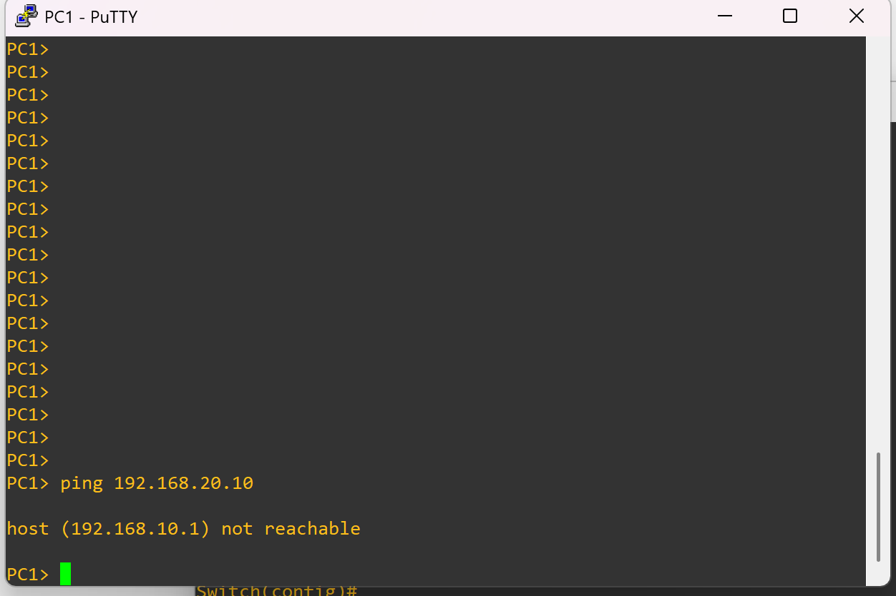

# ❌ Variant 2 – Missing Trunk (Broken)

## 🔎 Problem
The router-facing port (**Gi0/0**) on the switch was mistakenly left as an **access port** instead of being configured as a trunk.  

Because of this:  
- VLAN tags are not passed to the router.  
- Router-on-a-stick subinterfaces (`g0/0.10` and `g0/0.20`) never receive the VLAN traffic.  
- Inter-VLAN communication fails.

---

## 🖥️ Topology Snapshot
*(Switch-to-router link misconfigured)*  


---

## 🖥️ Verification

### PC1 → PC2 Ping
```vpcs
ping 192.168.20.10
````

📸 

Result: PC1 cannot reach PC2. Without a trunk, the router cannot route between VLAN 10 and VLAN 20.

---

## ✅ Reflection

* **Trunks are mandatory** for carrying multiple VLANs between switches and routers.
* If a router interface doesn’t see the VLAN tags, its subinterfaces won’t work.
* Always confirm trunking with `show interfaces trunk` on the switch.
