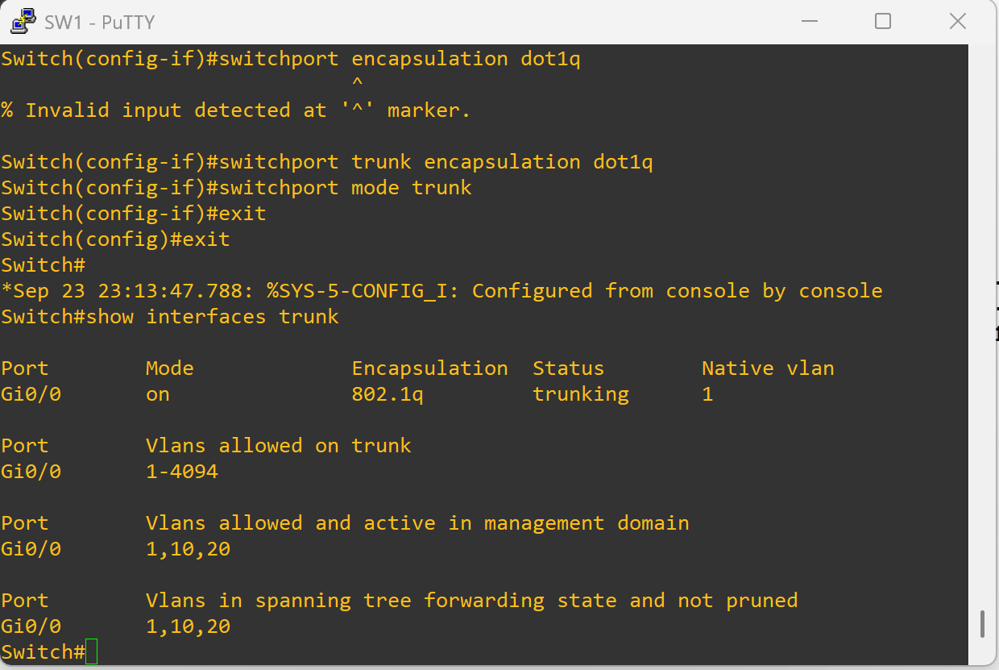
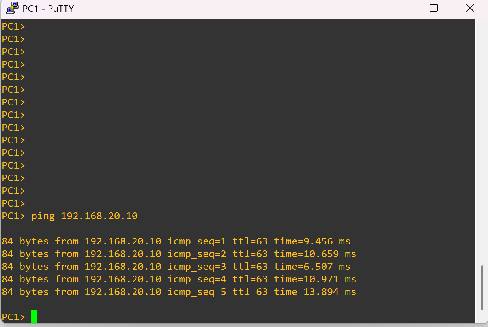

# ✅ Variant 2 – Missing Trunk (Fixed)

## 🔧 Solution
The switch port toward the router (**Gi0/0**) was reconfigured as a **trunk** so it can carry VLAN tags.  

```cisco
interface g0/0
 switchport trunk encapsulation dot1q
 switchport mode trunk
````

---

## 🖥️ Verification

### Check Trunk Status

```cisco
show interfaces trunk
```

📸 

Result: Gi0/0 now shows as a trunk with VLANs 10 and 20 allowed.

---

### PC1 → PC2 Ping

```vpcs
ping 192.168.20.10
```

📸 

Result: Inter-VLAN routing is restored. PC1 and PC2 can communicate across VLANs.

---

## ✅ Reflection

* Trunking is the **glue** between Layer 2 VLAN segmentation and Layer 3 inter-VLAN routing.
* Router-on-a-stick only works if the switch uplink is properly trunked.
* Verifying with `show interfaces trunk` is an essential troubleshooting step.
