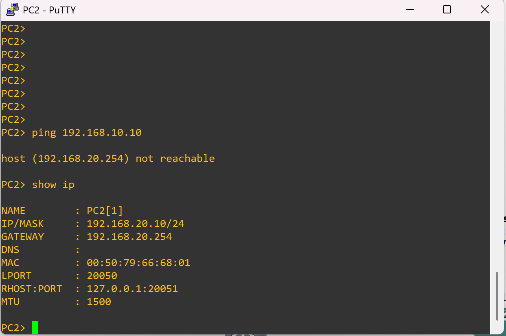

# ❌ Variant 3 – Wrong Default Gateway (Broken)

## 🔎 Problem
PC2 was configured with the **wrong default gateway**.  
Instead of pointing to `192.168.20.1` (its VLAN 20 gateway), it was set to another address.  

Because of this, PC2 cannot communicate outside its subnet — including with PC1 in VLAN 10.

---

## 🖥️ Topology Snapshot
*(PC2 with incorrect default gateway)*  


---

## 🖥️ Verification

### PC2 → PC1 Ping
```vpcs
ping 192.168.10.10
````

📸 

Result: The ping fails because PC2 sends traffic to a gateway that does not exist on VLAN 20.

---

## ✅ Reflection

* End devices must always use the **first-hop router IP in their subnet** as their default gateway.
* A wrong gateway setting isolates the host from all other networks.
* Always confirm device settings with `show ip` in VPCS before assuming the issue is on the router or switch.
