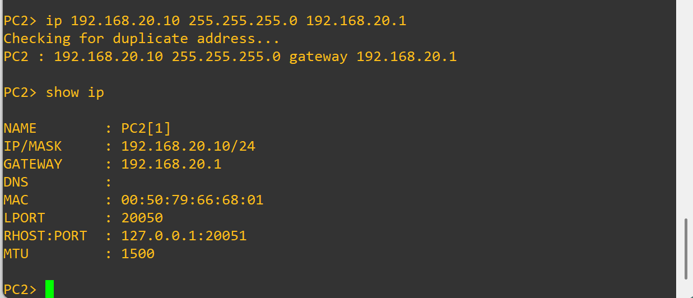
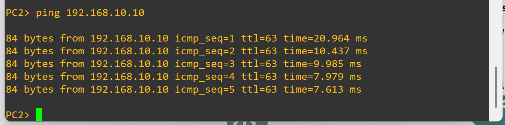

# ✅ Variant 3 – Wrong Default Gateway (Fixed)

## 🔧 Solution
PC2’s default gateway was corrected to `192.168.20.1`, which is the router subinterface for VLAN 20.  

```vpcs
ip 192.168.20.10 255.255.255.0 192.168.20.1
show ip
````

---

## 🖥️ Verification

### PC2 → Gateway Check

📸 

---

### PC2 → PC1 Ping

```vpcs
ping 192.168.10.10
```

📸 

Result: Connectivity between PC2 and PC1 is restored once the gateway is corrected.

---

## ✅ Reflection

* The **default gateway must match the router’s IP in the same VLAN subnet**.
* With the proper gateway set, PC2 can route traffic to other VLANs.
* Verifying with `show ip` on VPCS ensures correct addressing before deeper troubleshooting.
